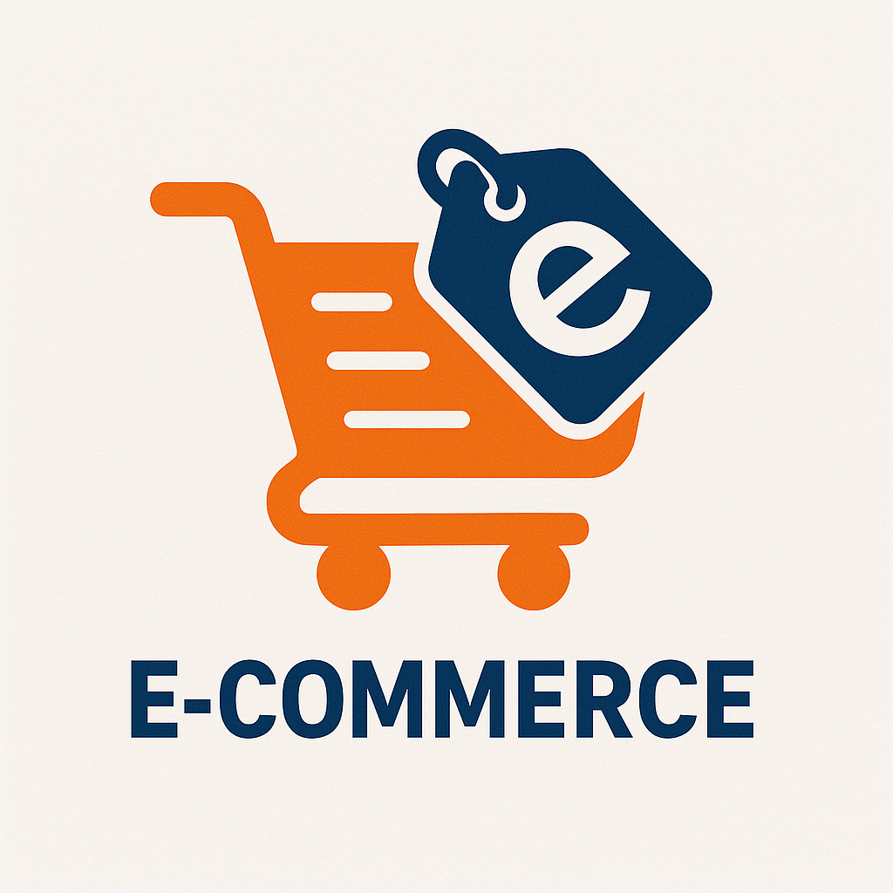

<p align="center">
  <a href="#">
    
  </a>
</p>

<h1 align="center">E-commerce Catalog – Vue (TS) + Vite</h1>

<p align="center">
  Aplikasi katalog produk sederhana menggunakan Fakestore API.<br/>
  Menampilkan satu produk, tombol Next Product, loader skeleton, dan tampilan unavailable.
  <br/>
  <a href="#penggunaan"><strong>Lihat cara penggunaan »</strong></a>
  <br/>
  <br/>
  <a href="#instalasi">Instalasi</a>
  ·
  <a href="#kontribusi">Kontribusi</a>
  ·
  <a href="#lisensi">Lisensi</a>
</p>

---

## 🚀 **Live Demo**

**🌟 Experience it live:** [https://ecommerce-catalog-ebon.vercel.app/](https://ecommerce-catalog-ebon.vercel.app/)

## Daftar Isi
- [Deskripsi](#deskripsi)
- [Fitur](#fitur)
- [Tech Stack](#tech-stack)
- [Instalasi](#instalasi)
  - [Prasyarat](#1-prasyarat)
  - [Clone & Dependensi](#2-clone--dependensi)
  - [Jalankan Lokal](#3-jalankan-lokal)
  - [Build & Preview](#4-build--preview)
  - [Testing](#5-testing)
  - [Deploy ke Vercel](#6-deploy-ke-vercel)
- [Penggunaan](#penggunaan)
- [Struktur Proyek](#struktur-proyek)
- [Kontribusi](#kontribusi)
- [Lisensi](#lisensi)

## Deskripsi
Katalog e-commerce yang menampilkan data dari Fakestore API (`https://fakestoreapi.com`).
Pengguna dapat menekan tombol “Next Product” untuk melihat produk berikutnya (1–20),
disertai loader skeleton saat fetching. Produk hanya ditampilkan bila kategori termasuk
men's clothing atau women's clothing, selain itu ditampilkan halaman “product unavailable”.

## Fitur
- Menampilkan detail 1 produk dari Fakestore API (id 1–20)
- Tombol “Next Product” (wrap-around 20 → 1)
- Loader skeleton (shimmer) saat fetching
- Halaman “unavailable” untuk kategori non-men/women
- Rating dinamis (dot filled mengikuti nilai rating)
- Responsif dan menggunakan CSS variabel warna

## Tech Stack
<p>
  <a href="https://vuejs.org/"></a>
  <a href="https://www.typescriptlang.org/"></a>
  <a href="https://vitejs.dev/"></a>
  <a href="https://pinia.vuejs.org/"></a>
  <a href="https://axios-http.com/"></a>
  <a href="https://vitest.dev/"></a>
  <a href="https://www.cypress.io/"></a>
</p>

## Instalasi
### 1) Prasyarat
- Node.js 18+ (disarankan 20+)
- npm (atau pnpm/yarn)

### 2) Clone & dependensi
```bash
git clone https://github.com/<username>/ecommerce-catalog.git
cd ecommerce-catalog
npm install
```

### 3) Jalankan Lokal
```bash
npm run serve          # dev server: http://localhost:5173
```

### 4) Build & Preview
```bash
npm run build          # output production di dist/
npm run preview        # preview build di lokal
```

### 5) Testing
```bash
npm run test           # unit test (Vitest)
npm run cy:open        # e2e (Cypress, GUI)
# npm run cy:run       # e2e headless
```

### 6) Deploy ke Vercel
- Via Dashboard: Import repo → Framework: Vite → Build: `npm run build` → Output: `dist`
- Via CLI:
```bash
npm i -g vercel
vercel          # preview
vercel --prod   # production
```
Opsional SPA fallback (`vercel.json`):
```json
{
  "builds": [{ "src": "index.html", "use": "@vercel/static-build", "config": { "distDir": "dist" } }],
  "routes": [{ "src": "/.*", "dest": "/index.html" }]
}
```

## Penggunaan
- Klik “Next Product” untuk memuat produk id berikutnya (wrap 20 → 1).
- Skeleton muncul selama request; rating dan dot filled mengikuti nilai rating API.
- Produk non men/women akan memunculkan halaman unavailable dengan tombol Next.

## Struktur Proyek
```
ecommerce-catalog/
├─ public/
├─ src/
│  ├─ assets/
│  │  ├─ style/page.css
│  │  └─ logo.png
│  ├─ components/
│  │  └─ ProductDisplay.vue
│  ├─ services/
│  │  └─ api.ts
│  ├─ stores/
│  │  └─ product.ts
│  ├─ App.vue
│  └─ main.ts
├─ index.html
├─ vite.config.ts
└─ package.json
```

## Kontribusi
1. Fork lalu buat branch fitur (`feat/nama-fitur`).
2. Commit dengan pesan yang jelas.
3. Buka Pull Request dan jelaskan perubahan + langkah uji.

## Lisensi
MIT License.

